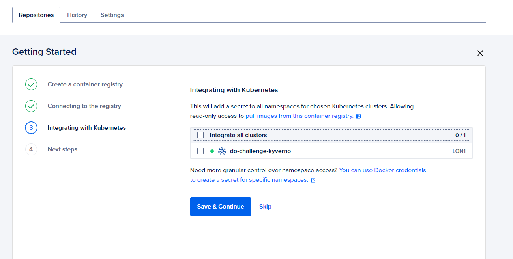
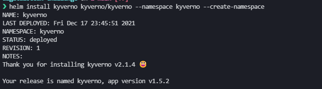
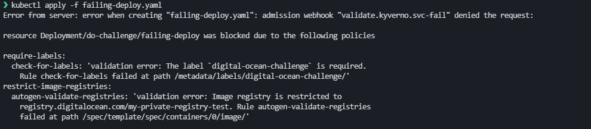
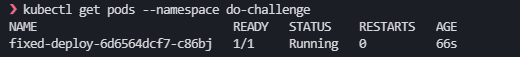

# Digital Ocean Kubernetes Challenge - Policy enforcement
Repo for 2021 Kubernetes Challenge by DigitalOcean. 

## Requirements
- Create a [DigitalOcean Kubernetes Cluster](https://cloud.digitalocean.com/kubernetes/clusters/new)
- Create a [DigitalOcean Container Registry](https://cloud.digitalocean.com/registry)
- Install [kubectl](https://kubernetes.io/docs/tasks/tools/#kubectl)
- Install [doctl](https://github.com/digitalocean/doctl#installing-doctl)
- Install [helm](https://helm.sh/docs/intro/install/)


## Integrate Registry with the cluster


## Connect to the cluster
- Get cluster kubeconfig using the appropriate command
    - Example: `$ doctl kubernetes cluster kubeconfig save <REDACTED>`
- Check cluster access
    ```bash
    $ kubectl cluster-info
    
    Kubernetes control plane is running at https://<REDACTED>.k8s.ondigitalocean.com
    CoreDNS is running at https://<REDACTED>.k8s.ondigitalocean.com/api/v1/namespaces/kube-system/services/kube-dns:dns/proxy

    To further debug and diagnose cluster problems, use 'kubectl cluster-info dump'.
    ```

## Push a image to the Docker 

- Build or pull a image:
    - `$ docker pull redis`
- Log into your DigitalOcean Container Registry:
    - `$ doctl registry login`
- Tag the image
    - `$ docker tag <IMAGE_ID> registry.digitalocean.com/my-private-registry-test/redis`
- Push the image to your registry
    - `$ docker push registry.digitalocean.com/my-private-registry-test/redis`

## Install Kyverno
- Add Kyverno Helm repository and scan for new charts
    - `$ helm repo add kyverno https://kyverno.github.io/kyverno/`
    - `$ helm repo update`

- Install Kyverno chart in the cluster
    - `$ helm install kyverno kyverno/kyverno --namespace kyverno --create-namespace`
    

- Check if Kyverno pod is running
    ```
    $ kubectl get pods
    NAME                       READY   STATUS    RESTARTS   AGE
    kyverno-6d94754db4-nbbvq   1/1     Running   0          3m20s
    ```

## Apply custom policies
- Two policies were created:
    - `mandatory-labels.yaml` - requires every deployment to contain the `digital-ocean-challenge` label
    - `restrict-registry.yaml`- restricts image registry to the one created previously `registry.digitalocean.com/my-private-registry-test` 
- Apply policies
    ```bash
    $ kubectl apply -f policies

    clusterpolicy.kyverno.io/require-labels configured
    clusterpolicy.kyverno.io/restrict-image-registries configured
    ```
- Check if policies were properly installed
    ```bash
    $ kubectl get cpol
    NAME                        BACKGROUND   ACTION    READY
    require-labels              true         enforce   true
    restrict-image-registries   true         enforce   true
    ```

## Test policy enforcing
- Create a new namespace
    - `$ kubectl create ns do-challenge`
- Create a new deployment
    - `$ kubectl apply -f failing-deploy.yaml`
- Check if deployment is blocked
    
- Fix errors and apply the new deployment
    - `$ kubectl apply -f fixed-deploy.yaml`
    